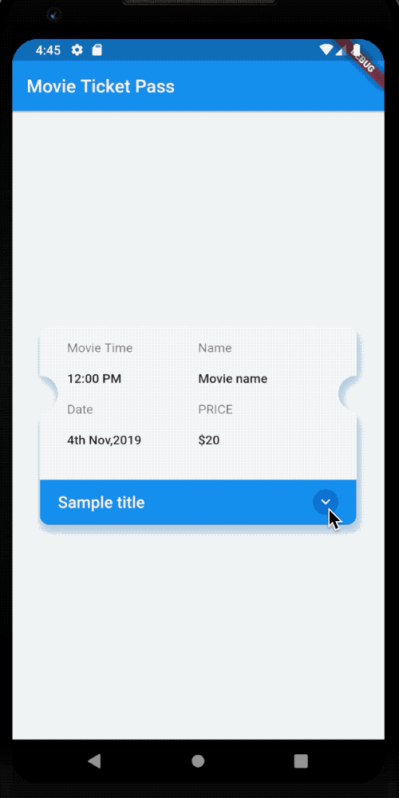

# ticket_pass_package


A Flutter package to display the purchase of a ticket/pass along with additional details such as list of buyers.

The source code is **100% Dart**, and everything resides in the [/lib](https://github.com/gouthamkumar253/flutter_ticket_pass) folder.

## Kindly :star: the repo to support the project
 [](https://github.com/gouthamkumar253)

## 💻 Installation

In the `dependencies:` section of your `pubspec.yaml`, add the following line:

```yaml
ticket_pass_package: <latest_version>
```

Import in your project:
```dart
import 'package:ticket_pass_package/ticket_pass.dart';
```

## ❔Basic Usage
```dart
import 'package:flutter/material.dart';
import 'package:ticket_pass_package/ticket_pass.dart';

void main() => runApp(MyApp());

class MyApp extends StatelessWidget {
  List<String> sample = <String>[
    'Sample data 1',
    'Sample data 2',
    'Sample data 3',
    'Sample data 4',
    'Sample data 5',
    'Sample data 6',
    'Sample data 7',
    'Sample data 8'
  ];
  @override
  Widget build(BuildContext context) {
    return MaterialApp(
      title: 'Movie Ticket Pass',
      home: Scaffold(
        appBar: AppBar(
          title: Text('Movie Ticket Pass'),
        ),
        body: Center(
          child: TicketPass(
            alignment: Alignment.center,
            animationDuration: Duration(seconds: 2),
            expansionChild: Container(
              color: Colors.black,
              height: 200,
            ),
            expandedHeight: 500,
            expandIcon: CircleAvatar(
              maxRadius: 14,
              child: Icon(
                Icons.keyboard_arrow_down,
                color: Colors.white,
                size: 20,
              ),
            ),
            expansionTitle: Text(
              'Purchased By',
              style: TextStyle(
                fontWeight: FontWeight.w600,
              ),
            ),
            purchaserList: sample,
            separatorColor: Colors.black,
            separatorHeight: 2.0,
            color: Colors.white,
            curve: Curves.easeOut,
            titleColor: Colors.blue,
            shrinkIcon: CircleAvatar(
              maxRadius: 14,
              child: Icon(
                Icons.keyboard_arrow_up,
                color: Colors.white,
                size: 20,
              ),
            ),
            ticketTitle: Text(
              'Sample title',
              style: const TextStyle(
                color: Colors.white,
                fontWeight: FontWeight.w600,
                fontSize: 18,
              ),
            ),
            titleHeight: 50,
            
            width: 300,
            height: 200,
            shadowColor: Colors.blue.withOpacity(0.5),
            elevation: 8,
            shouldExpand: true,
            child: Container(
              color: Colors.blue,
              width: 10,
            ),
          ),
        ),
      ),
    );
  }
}
```
## Screenshots


## 👨 Developed By

```
Goutham Kumar R
```


## Getting Started

For help getting started with Flutter, view our online [documentation](https://flutter.dev/).

For help on editing package code, view the [documentation](https://flutter.dev/developing-packages/).
